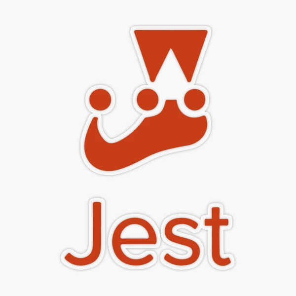

<p align="center">
  
  
  
  
  
</p>


# k11TechLab Vibium Jest AI Test Framework

A production-style test automation framework for `https://k11softwaresolutions.com`
featuring an AI agent and MCP server integration, built with Jest, Vibium,
structured reporting, Lighthouse auditing, AI-assisted test generation, and GitHub Actions CI/CD.

## Highlights

- Shared Vibium browser setup with reusable page objects
- Coverage across smoke, functional, API, DB, devices, E2E, and Lighthouse
- Timestamped HTML and JSON reports in `reports/`
- AI-assisted test generation with optional OpenAI integration
- AI agent and MCP server integration for tool-driven browser automation
- GitHub Actions CI for API and smoke validation with artifact upload
- GitHub Actions release workflow for showcase bundle packaging
- MIT licensed and production-ready

## Capabilities & Innovations

- **Vibium + TypeScript + Jest:** Tests, shared setup, page objects, and helpers are implemented in TypeScript. Page objects live under `src/k11-platform/pageObjects/`, shared browser lifecycle is handled in `src/k11-platform/hooks/`, and reusable helpers live in `src/utils/`.
- **Mixed-layer automation:** The framework covers smoke, functional, API, DB, device, E2E, Lighthouse, and AI-generated test flows in a single repository.
- **Lighthouse automation:** Lighthouse runs generate HTML and JSON outputs in `artifacts/lighthouse/` for performance-focused validation and demo-ready reporting.
- **DB & API helpers:** Reusable utilities in `src/utils/` support API validation, DB access, and test data handling.
- **AI-assisted test generation:** A repo-aware generator in `scripts/ai/` can inspect page objects, build Jest-compatible Vibium tests, and optionally run them immediately.
- **Prompt and runner ecosystem:** Root-level `prompts/` contains reusable generation goals, and `ai-test-runner/` provides one-click shell, PowerShell, CMD, and npm runner options.
- **Agent + MCP demo:** `mcp-server/` and `agent/` demonstrate how an AI agent can call Vibium-backed browser tools through a real stdio MCP server.
- **Advanced reporting:** Timestamped HTML and JSON Jest reports are written to `reports/`, with screenshots and Lighthouse artifacts captured under `artifacts/`.
- **CI / CD:** GitHub Actions workflows in `.github/workflows/` run validation suites, upload artifacts, and package a release-ready showcase bundle.
- **Clean demo output:** Opt-in debug logging via `K11_DEBUG=true` keeps normal runs polished while preserving diagnostics when needed.
- **OpenAI integration with fallback mode:** The AI generator uses the OpenAI Responses API when configured and falls back to a local repo-aware template when AI access is unavailable.

## Framework Architecture

```text
src/k11-platform/
|-- config/        app URLs, browser, timeouts
|-- hooks/         shared Vibium lifecycle setup
|-- pageObjects/   reusable page models and actions
|-- testdata/      CSV and other input data
|-- tests/
|   |-- smoke/
|   |-- functional/
|   |-- api/
|   |-- db/
|   |-- devices/
|   |-- e2e/
|   |-- lighthouse/
|   |-- generated/
|-- apiResponses/  response payload helpers
src/utils/         data, DB, API, UI, and debug helper utilities
scripts/
|-- ai/            AI test generator and prompt-driven creation flow
|-- vibium-demo/   lightweight Vibium demos for humans and agents
|-- jest-root-report.cjs  Jest HTML/JSON report writer
agent/             OpenAI-driven MCP client runner
mcp-server/        Vibium-backed MCP tool server
ai-test-runner/    one-click AI generation runners
prompts/           reusable goal prompts for AI generation
artifacts/         screenshots, Lighthouse outputs, and demo assets
reports/
|-- *.html/*.json  timestamped Jest reports
|-- ai-agent/      timestamped AI agent HTML/JSON run reports
.github/workflows/ CI and release workflows
```

## Execution Flow

1. Jest starts a suite
2. `setupVibium()` launches the browser and page
3. Tests call shared page objects from `src/k11-platform/hooks/vibiumSetup.ts`
4. Assertions run on live UI, API, DB, or performance flows
5. `teardownVibium()` closes the browser
6. Reports and artifacts are written to disk

## Tech Stack

- Jest for test execution and mixed-layer orchestration
- Vibium for browser automation
- TypeScript for framework, page objects, helpers, and generated tests
- OpenAI Responses API for AI-assisted test generation and the demo agent
- Model Context Protocol (MCP) over stdio for tool-driven agent integration
- Lighthouse for performance audits
- GitHub Actions for CI/CD

## Prerequisites

- Node.js 18+
- Python 3.9+
- Vibium runtime and browser dependencies

## Install

### JavaScript

```bash
npm install
```

### Python

```bash
python -m pip install -r requirements.txt
```

## Run

Run all tests:

```bash
npm test
```

Run targeted suites:

```bash
npm run test:smoke
npm run test:functional
npm run test:api
npm run test:db
npm run test:devices
npm run test:e2e
npm run test:lighthouse
```

Run the CI suite locally:

```bash
npm run test:ci
```

Run legacy Vibium demos:

```bash
npm run vibium:k11:async
npm run vibium:k11:sync
python scripts/vibium/k11_smoke.py
```

## Agentic MCP Demo

Run the Vibium MCP server:

```bash
npm run mcp:server
```

Run the demo agent:

```bash
npm run agent:run -- "Open the K11 homepage and verify the contact page is reachable."
```

See [`mcp-server/README.md`](mcp-server/README.md) and [`scripts/vibium-demo/README.md`](scripts/vibium-demo/README.md) for the MCP and agentic demo details.

## AI-Assisted Generation

Create a starter Jest + Vibium test:

```bash
npm run ai:generate:test -- --page-object LoginPage --goal "Verify valid login reaches dashboard"
```

Generate and run immediately:

```bash
npm run ai:generate:test -- --page-object HomePage --goal "Verify the hero and navigate to services" --run
```

Use preset one-click runners:

```bash
npm run ai:runner:homepage
npm run ai:runner:login
npm run ai:runner:formslab
```

The generator auto-loads `.env` from the repo root if present. Start from
`.env.example` for OpenAI configuration.

See `doc/ai-test-generator.md` for generator details.

## CI/CD

GitHub Actions workflows are included in `.github/workflows/`:

- `ci.yml`
  Runs on push, pull request, and manual trigger. Installs Node and Python dependencies, runs API and smoke suites, and uploads reports and artifacts.

- `release-showcase.yml`
  Runs on version tags like `v1.0.0` or via manual trigger. Packages the showcase framework into a zip file and publishes it as a workflow artifact. On tag pushes, it also creates a GitHub release.

## Reports And Artifacts

Generated outputs are written to:

- `reports/` for timestamped Jest HTML and JSON reports
- `artifacts/screenshots/` for UI screenshots
- `artifacts/lighthouse/` for Lighthouse HTML and JSON outputs

## Documentation

Additional docs are available in `doc/`, including:

- `doc/ai-assisted-test-automation.md`
- `doc/ai-test-generator.md`
- `doc/ai-test-generator-functions.md`
- `doc/jest-vs-fixtures.md`
- `doc/jest-vs-playwright-test.md`
- `doc/reporting-implementation.md`
- `doc/mcp-stdio.md`
- `doc/vibium-features.md`

Additional runnable demos and agent docs:

- `scripts/vibium-demo/README.md`
- `mcp-server/README.md`

## License

This project is licensed under the MIT License. See `LICENSE`.


## Author

**Kavita Jadhav**

Accomplished Full Stack Developer and Test Automation Engineer specializing in modern web application development, robust full stack solutions, and scalable automation frameworks. Expert in Playwright, advanced quality engineering, and driving best practices for high-impact, reliable software delivery.

LinkedIn: [https://www.linkedin.com/in/kavita-jadhav-tech/](https://www.linkedin.com/in/kavita-jadhav-tech/)


## About k11 Software Solutions

**k11 Software Solutions** is a leading provider of modern, AI-powered test automation, DevOps, and quality engineering services. We help organizations accelerate digital transformation with robust, scalable, and intelligent automation solutions tailored for SaaS, web, and enterprise platforms.

- Website: [https://k11softwaresolutions.com](https://k11softwaresolutions.com)
- Contact: k11softwaresolutions@gmail.com

*Partner with us to future-proof your QA and automation strategy!*

## Follow Me
<p align="center">
  <a href="https://github.com/K11-Software-Solutions/" target="_blank">
    
  </a>
  <a href="https://k11softwaresolutions.com" target="_blank">
    
  </a>
</p>


